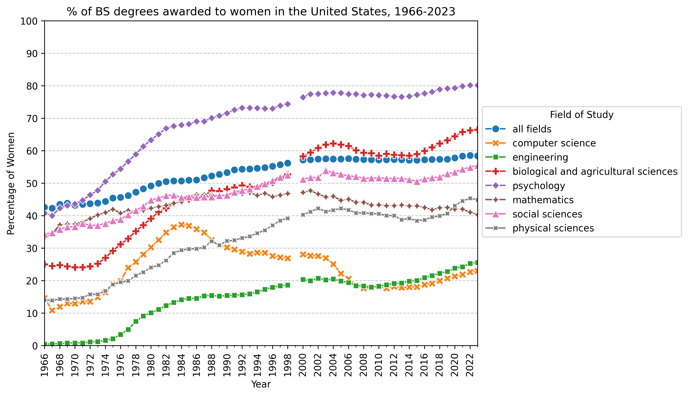

# Gender Codes: Why Women are Leaving Computing, Updated Figures

This repository is an updated understanding of the figures and charts from the
IEEE 2010 Publication, *Gender Codes: Why Women Are Leaving Computing* 
(ISBN: 978-0-470-59719-4). 

Skip to the [figures](#Figures)

Skip to the [other figures](#other-figures)

## Development

Python tooling managed by [`uv`](https://github.com/astral-sh/uv).

```sh
uv sync
```

## Figures

### Figure 2.2 
Percentage of bachelors degrees awarded to women in the United States, 1966-2023



Note the original figure 2.2 in the book used National Science Foundation (NSF), *Science and Engineering (S&E) Degrees 1966-2006*. 
The latest version I could find of this data was: *NSF S&E Degrees 1966-2012*

Interestingly Computer Science & Mathematics are combined in these publications. The reasoning is preserved by the NSF as follows:
> In the Survey of Earned Doctorates (SED), data on computer sciences were not collected separately from mathematics until 1978, and complete data on computer sciences are not available from the SED until 1979. Data shown for 1966-78 are from the Integrated Postsecondary Education Data System Completions Survey.

Since S&E does not go up to present day, I combined various data sources.

The data used is as follows, and is available in the raw format at [`./data/raw/fig2.2/`](./data/raw/fig2.2/)
- 1966-1998: National Science Foundation (NSF), *Science and Engineering (S&E) Degrees 1966-2012*
- ~~1999: IPEDs Completions: *Awards/degrees conferred by program (2-digit CIP code), award level, race/ethnicity, and gender*~~
  This specific year did not have this publication, it does have by 6-digit CIP code, but I am not wrangling this for one year of data.
- 1999-2014, IPEDs Completions: *Bachelor's degrees conferred at Title IV institutions by race/ethnicity, field of study, gender*
  - **Exception** 2002-03, IPEDs Completions: *Bachelor's degrees conferred for first majors by Title IV degree-granting institutions, by race/ethnicity, field of study, and gender*
  <!-- - 1999-00 to 2001-02 use CIPS edition 1990
  - 2002-03 to 2008-09 use CIPS edition 2000
  - 2009-10 to 2018-19 use CIPS edition 2010 -->
- 2014-2023, IPEDs Completions, generated manually through Summary Tables.

### Figure 2.3
TODO

### Figure 2.4
TODO

### Figure 2.9
TODO
