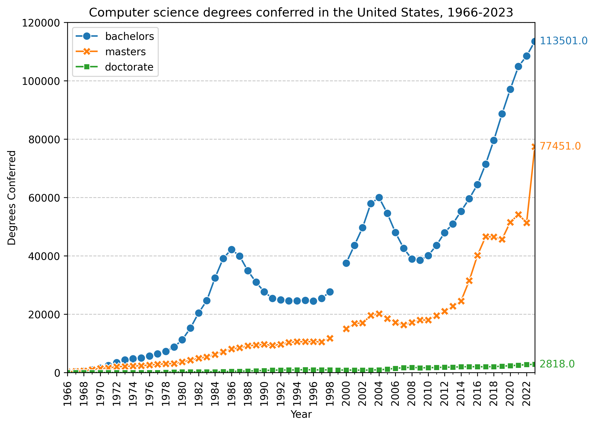
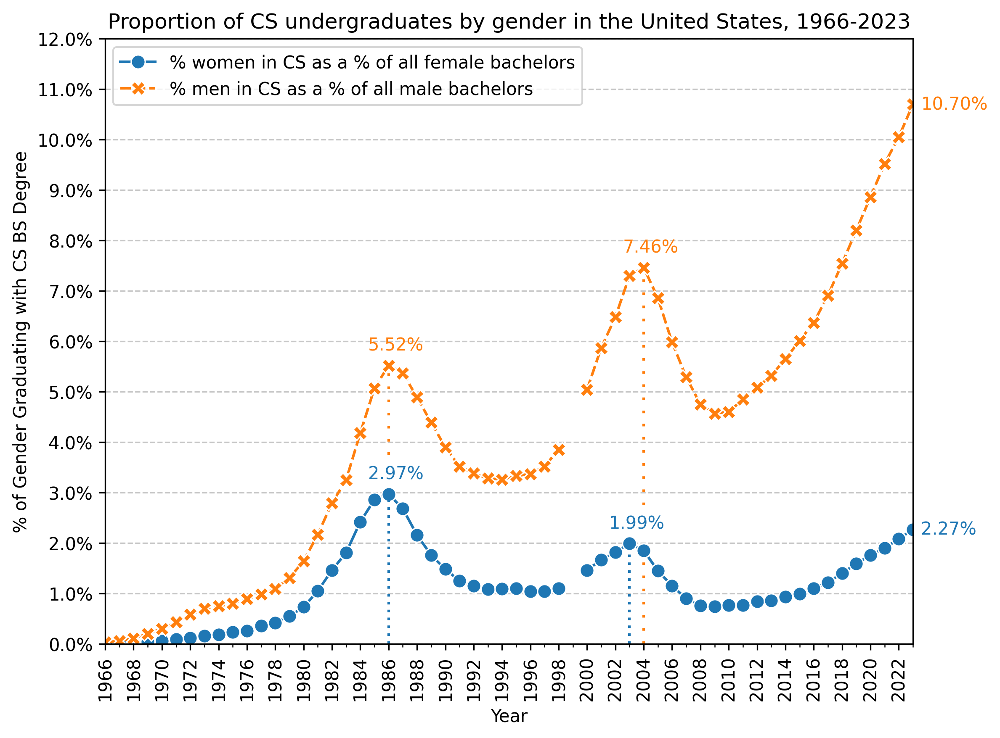

# Gender Codes: Why Women are Leaving Computing, Updated Figures

An updated understanding of figures, charts, and tables from 
*Gender Codes: Why Women Are Leaving Computing* (ISBN: 978-0-470-59719-4)

Skip to the [figures](#Figures)

## Development

Python tooling managed by [`uv`](https://github.com/astral-sh/uv).

```sh
uv sync
```

## License

This repository is MIT Licensed. Feel free to copy/reproduce these charts or
datasets with credit.

All data that was ingested has been preserved here,
but I highly recommend if you are not using my processed data to instead receive
the data from their original sources. All figures will denote where the data has come from. 

## Figures

### Figure 2.2 
<figure>
  <figcaption>Percentage of bachelors degrees awarded to women in the United States for various disciplines, 1966-2023</figcaption>
  
</figure>

Note the original figure 2.2 in the book used National Science Foundation (NSF), *Science and Engineering (S&E) Degrees 1966-2006*. 
The latest version I could find of this data was: *NSF S&E Degrees 1966-2012*

Interestingly Computer Science & Mathematics are combined in these publications. The reasoning is preserved by the NSF as follows:
> In the Survey of Earned Doctorates (SED), data on computer sciences were not collected separately from mathematics until 1978, and complete data on computer sciences are not available from the SED until 1979. Data shown for 1966-78 are from the Integrated Postsecondary Education Data System Completions Survey.

Since S&E does not go up to present day, I combined various data sources.

The data used is as follows, and is available in the raw format at [`./data/fig2.2/raw/`](./data/fig2.2/raw/)
- 1966-1998: National Science Foundation (NSF), *Science and Engineering (S&E) Degrees 1966-2012*
- ~~1999: IPEDs Completions: *Awards/degrees conferred by program (2-digit CIP code), award level, race/ethnicity, and gender*~~
  This specific year did not have this publication, it does have by 6-digit CIP code, but I am not wrangling this for one year of data.
- 1999-2014, IPEDs Completions: *Bachelor's degrees conferred at Title IV institutions by race/ethnicity, field of study, gender*
  - **Exception** 2002-03, IPEDs Completions: *Bachelor's degrees conferred for first majors by Title IV degree-granting institutions, by race/ethnicity, field of study, and gender*
  <!-- - 1999-00 to 2001-02 use CIPS edition 1990
  - 2002-03 to 2008-09 use CIPS edition 2000
  - 2009-10 to 2018-19 use CIPS edition 2010 -->
- 2014-2023, IPEDs Completions, retrieved/generated through Summary Tables.

I have a fully processed dataset for consumption at [`./data/fig2.2/processed/Bachelors2000-23.csv`](./data/fig2.2/processed/Bachelors2000-23.csv)
which contains IPEDs data from the end of academic year 2000 to 2023. The reason it doesn't include earlier data is because
NSF S&E Degree data 1996-2012, is not broken out by similiar CIPs. 

**This dataset kinda sucks, I don't recommend using it**

Use this chart with this citation:
```bibtex
@misc{Duong_chart,
  author = {Duong, Cody},
  title = {{Percentage of bachelors degrees awarded to women in the United States for various disciplines, 1966-2023}},
  url = {https://github.com/codyduong/Gender-Codes/tree/master/media/fig2.2.png},
  year = 2025
}
```
> Duong, C. (2025). Percentage of bachelors degrees awarded to women in the United States for various disciplines, 1966-2023 [Graph]. https://github.com/codyduong/Gender-Codes/tree/master/media/fig2.2.png

### Figure 2.3
TODO

### Figure 2.4
TODO

### Figure 2.5

<figure>
  <figcaption>Computer science degrees conferred in the United States, 1966-2023</figcaption>
  
</figure>

The raw data used:
- 1966-2012: National Science Foundation (NSF), *Science and Engineering (S&E) Degrees 1966-2012*
- 2012-2023: IPEDs Completions, retrieved/generated through Summary Tables.

The processed data can be found in two formats, depending on your usage:
- [Computer Science Degrees Award Level, and Gender Conferred by Year, (1966-2023)](./data/fig2.5/processed/Computer%20Science%20Degrees%20Award%20Level,%20and%20Gender%20Conferred%20by%20Year%20(1966-2023).csv)
- [Computer Science Degrees Conferred by Year, Award Level, and Gender (1966-2023)](./data/fig2.5/processed/Computer%20Science%20Degrees%20Conferred%20by%20Year,%20Award%20Level,%20and%20Gender%20(1966-2023).csv)

Use this chart/data with this citation:
```bibtex
@misc{Duong_chart,
  author = {Duong, Cody},
  title = {{Computer science degrees conferred in the United States, 1966-2023}},
  url = {https://github.com/codyduong/Gender-Codes/tree/master/media/fig2.5.png},
  year = 2025
}

@misc{Duong_dataset1,
  author = {Duong, Cody},
  title = {{Computer Science Degrees (Award Level, and Gender) Conferred by Year (1966-2023)}},
  url = {https://github.com/codyduong/Gender-Codes/tree/master/data/fig2.5/processed/Computer%20Science%20Degrees%20Award%20Level,%20and%20Gender%20Conferred%20by%20Year%20(1966-2023).csv},
  year = 2025
}

@misc{Duong_dataset2,
  author = {Duong, Cody},
  title = {{Computer Science Degrees Conferred by Year, Award Level, and Gender (1966-2023)}},
  url = {https://github.com/codyduong/Gender-Codes/tree/master/data/fig2.5/processed/Computer%20Science%20Degrees%20Conferred%20by%20Year,%20Award%20Level,%20and%20Gender%20(1966-2023).csv},
  year = 2025
}
```
> Duong, C. (2025). Computer science degrees conferred in the United States, 1966-2023 [Graph]. https://github.com/codyduong/Gender-Codes/tree/master/media/fig2.5.png
>
> Duong, C. (2025). Computer Science Degrees (Award Level, and Gender) Conferred by Year (1966-2023) [Data set]. https://github.com/codyduong/Gender-Codes/tree/master/data/fig2.5/processed/Computer%20Science%20Degrees%20Award%20Level,%20and%20Gender%20Conferred%20by%20Year%20(1966-2023).csv
>
> Duong, C. (2025). Computer Science Degrees Conferred by Year, Award Level, and Gender (1966-2023) [Data set]. https://github.com/codyduong/Gender-Codes/tree/master/data/fig2.5/processed/Computer%20Science%20Degrees%20Conferred%20by%20Year,%20Award%20Level,%20and%20Gender%20(1966-2023).csv

### Figure 2.9
TODO

### Figure 13.2

<figure>
  <figcaption>Proportion of CS Graduates by Gender in the United States, 1966-2023</figcaption>
  
</figure>

The raw data used:
- 1966-2012: National Science Foundation (NSF), *Science and Engineering (S&E) Degrees 1966-2012*
- 2012-2023: IPEDs Completions, retrieved/generated through Summary Tables.

The processed data::
- [Proportion of Undergraduates earning Computer Science Degrees by Gender, 1966-2023](./data/fig13.2/processed/Proportion%20of%20Undergraduates%20earning%20Computer%20Science%20Degrees%20by%20Gender,%201966-2023.csv)

Use this chart/data with this citation:
```bibtex
@misc{Duong_chart,
  author = {Duong, Cody},
  title = {{Proportion of CS Graduates by Gender in the United States, 1966-2023}},
  url = {https://github.com/codyduong/Gender-Codes/tree/master/media/fig13.2.png},
  year = 2025
}

@misc{Duong_dataset1,
  author = {Duong, Cody},
  title = {{Proportion of Undergraduates earning Computer Science Degrees by Gender, 1966-2023}},
  url = {https://github.com/codyduong/Gender-Codes/tree/master/data/fig13.2/processed/Proportion%20of%20Undergraduates%20earning%20Computer%20Science%20Degrees%20by%20Gender,%201966-2023.csv},
  year = 2025
}
```
> Duong, C. (2025). Proportion of CS Graduates by Gender in the United States, 1966-2023 [Graph]. https://github.com/codyduong/Gender-Codes/tree/master/media/fig13.2.png
>
> Duong, C. (2025). Proportion of Undergraduates earning Computer Science Degrees by Gender, 1966-2023 [Data set]. https://github.com/codyduong/Gender-Codes/tree/master/data/fig13.2/processed/Proportion%20of%20Undergraduates%20earning%20Computer%20Science%20Degrees%20by%20Gender,%201966-2023.csv